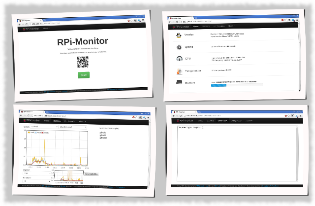

# RPi-Monitor

**Author**: Xavier Berger

**Blog**: [RPi-Experience](http://rpi-experiences.blogspot.fr/)

## About

**RPi-Monitor** is a self monitoring application designed to run on [Raspberry Pi](http://raspberrypi.org).

For performance and security reason, **RPi-Monitor** separates the extraction of the information from the
presentation of the information.

The extraction of the information is done by a process designed to run as a daemon (which can be executed as root).
The extracted key performance indicators (KPI) from the computer are stored them into a Round Robin Database (RRD)
to keep an history of the health of the computer. rpimonitord is the perl script also starts the embedded web
server giving access to the pages. The web server is running into a separate process owned by a non root user
(the user 'pi' by default).

The presentation of the information is performed by HTML5 pages. These pages dynamically download the
information extracted from the previous script and perform the rendering the in a nice looking format
(using [bootstrap](http://twitter.github.io/bootstrap/), [jquery](http://jquery.com/),
[jsqrencode](https://code.google.com/p/jsqrencode/) and [javascriptrrd](http://javascriptrrd.sourceforge.net/)).
This architecture has the advantage in an embedded architecture to offload the server task and delegate
processing and rendering to the client.

Finnally note that the embedded server doesn't provide access control or authentication. It is still possible
to not start the embeded web server and use an external web server to deliver the pages.

## Prerequisite

Before installing **RPi-Monitor** you should install the dependencies. To do so, execute the following command:

    sudo apt-get install librrds-perl libhttp-daemon-perl

## Installation

Download **RPI-Monitor** debian package from <https://github.com/XavierBerger/RPi-Monitor-deb/tree/master/packages> and install it
with the following command:

    sudo dpkg -i rpimonitor_1.0-1_all.deb

That's it, your Raspberry Pi is monitored. You can now browse <http://your_Raspberry_Pi_address:8888> to
access to the interactive web interface.

To remove the package you can use one ot the following command.
If you want to remove the program but keep the configuration files and statistics:

    sudo dpkg --remove rpimonitor

If you want to purge everything related to the program:

    sudo dpkg --purge rpimonitor

## FAQ

**When I try to start rpimonitord I've the error "Can't locate XXXXX.pm "**

A perl package is missing, check the perequisit.

**Can I  run RPi-Monitor on a computer other than a Raspberry Pi?**

Yes, you can. You will have to perform the manual installation and update rpimonitor.conf to reflect 
your hardware arhitecture. If you system is using upstart (like Unbuntu), you can use the upstart 
script also provided. Refer to [INSTALL.md](https://github.com/XavierBerger/RPi-Monitor/blob/master/INSTALL.md).

**I did update the configuration but I can't see the change in rrd**

If you change the configuration , the _rrd_ files will have to be regenerated. 
Delete the _rrd_ file concerned by the change  (in /usr/share/rpimonitor/web/stat if you installed the package)
and restart rpimonitord with the following command:

    sudo /etc/init.d/rpimonitord restart

