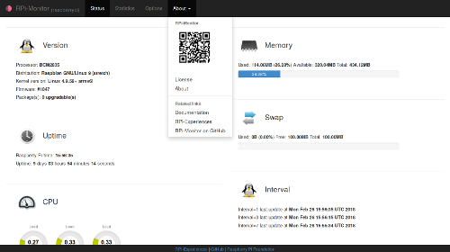

# **RPi-Monitor**

## Overview

[**RPi-Monitor**](http://rpi-experiences.blogspot.fr/) is an application designed to perform
real time monitoring embedded devices.

The development platform is a [Raspberry Pi](http://raspberrypi.org) v1 rev. B.

**RPi-Monitor** provides a lot of feature such as Embedded Web server, Alert messaging, SNMP integration...

For details, refer to [**RPi-Monitor** keys features](https://xavierberger.github.io/RPi-Monitor-docs/01_features.html) in documentation.

## Installation

Installation of **RPi-Monitor** is detailled in [getting started](https://xavierberger.github.io/RPi-Monitor-docs/11_installation.html) chapter of documentation.

Each release can be installed with a Debian package for **Raspbian**.

For other (unsupported) distribution see [Custom installation](https://xavierberger.github.io/RPi-Monitor-docs/12_custom_installation.html) chapter of documentation

## Documentation

If you want to install, use or customize **RPi-Monitor** refer to [documentation](https://xavierberger.github.io/RPi-Monitor-docs/index.html)

If you want to see example of configuration and see what **RPi-Monitor** can do, refer to
[RPi-Monitor Usages](https://xavierberger.github.io/RPi-Monitor-docs/30_index.html).

Frequently Asked Question find answer into the [FAQ](https://xavierberger.github.io/RPi-Monitor-docs/14_faq.html) page.

## Development

If you want to participate and propose a pull request, refer to [contributing](https://xavierberger.github.io/RPi-Monitor-docs/41_contributing.html) chapter of documentation.

**Note**: Pull request perfomed on **develop** branch will be integrated as soon as possible. Pull request perform on master branche may only be integrated when a new version is published (or not may not be integrated at all...)

## Author / News / License

**Author**: Xavier Berger

**Latest news** : [RPi-Experience Blog](http://rpi-experiences.blogspot.fr/)

**License**: [GPLv3](LICENSE)
