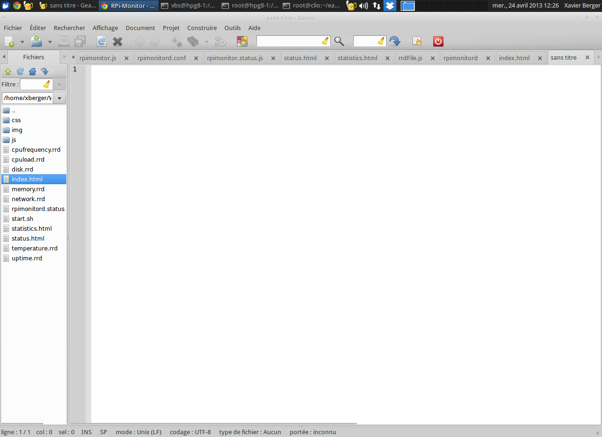
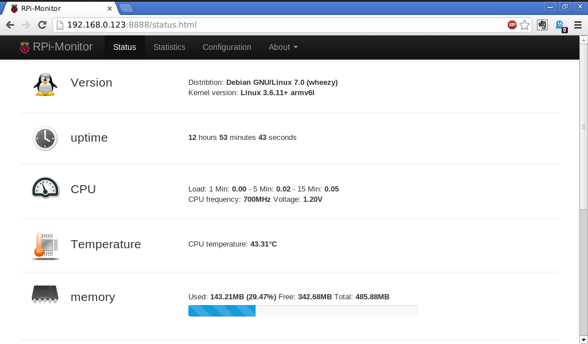
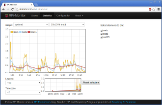
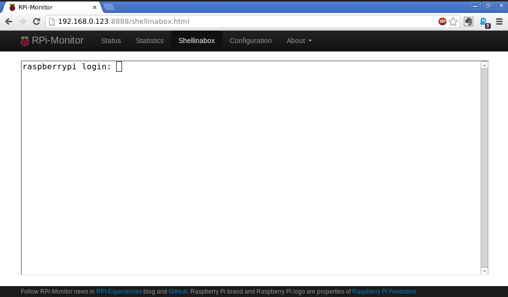

-------
**WARNING: The current code may have bugs. Program is still in development.**

-------

# RPi-Monitor

**Author**: Xavier Berger

**Blog**: [RPi-Experience](http://rpi-experiences.blogspot.fr/)

## About

**RPi-Monitor** is a self monitoring application designed to run on [Raspberry Pi](http://raspberrypi.org).

For performance and security reason, **RPi-Monitor** separates the extraction of the information from the
presentation of the information.

The extraction of the information is done by a process designed to run as a daemon (which can be executed as root).
The extracted key performance indicators (KPI) from the computer are stored them into a Round Robin Database (RRD)
to keep an history of the health of the computer. rpimonitord is the perl script also starts the embedded web
server giving access to the pages. The web server is running into a separate process owned by a non root user
(the user 'pi' by default).

The presentation of the information is performed by HTML5 pages. These pages dynamically download the
information extracted from the previous script and perform the rendering the in a nice looking format
(using [bootstrap](http://twitter.github.io/bootstrap/), [jquery](http://jquery.com/),
[jsqrencode](https://code.google.com/p/jsqrencode/) and [javascriptrrd](http://javascriptrrd.sourceforge.net/)).
This architecture has the advantage in an embedded architecture to offload the server task and delegate
processing and rendering to the client.

You may notice that the look and feel of the status page is clearly inspired by
[Raspcontrol](https://github.com/Bioshox/Raspcontrol).

Finnally note that the embedded server doesn't provide access control or authentication. It is still possible
to not start the embeded web server and use an external web server to deliver the pages.

## Prerequisite

Before installing **RPi-Monitor** you should install the dependencies. To do so, execute the following command:

    sudo apt-get install librrds-perl libhttp-daemon-perl libhttp-daemon-ssl-perl

## Download

#### .zip Download

You can download this as a _.zip_ from the GitHub Repository via the following link:

    https://github.com/XavierBerger/RPi-Monitor/zipball/master

#### Git Clone

If you have Git installed you can clone the repository with the following command

    git clone https://github.com/XavierBerger/RPi-Monitor.git

## I can't wait! How can I test it?

Start rpimonitord from directory _RPi-Monitor/rpimonitor_ with the command

    ./rpimonitord

That's it, your Raspberry Pi is monitored. You can now browse <http://your_Raspberry_Pi_address:8888> to
access to the interactive web interface.

## Installing rpimonitor as a daemon

If you want to start **RPi-Monitor** as a daemon at Raspberry Pi startup, copy the directory _rpimonitor_ in _/usr/local_

    sudo cp -a RPi-Monitor/rpimonitor /usr/local/rpimonitor

Copy the upstart script into _/etc/init.d_

    sudo cp RPi-Monitor/init/sysv/rpimonitor /etc/init.d/

Start the daemon

    sudo /etc/init.d/rpimonitor start

That's it, your Raspberry Pi is monitored. You can now browse <http://your_Raspberry_Pi_address:8888> to
access to the interactive web interface. Note: you can delete the directory _RPi-Monitor_ which is no more used.

To stop the daemon

    sudo /etc/init.d/rpimonitor stop

To startup automatically **RPi-Monitor** at startup, create a link to the system starts:

    cd /etc/rc2.d
    sudo ln -s ../init.d/S10rpimonitor

## FAQ

**When I try to start rpiminitord I've the error "Can't locate XXXXX.pm "**

A perl package is missing, check the perequisit.

**Can I  run RPi-Monitor on a computer other than a Raspberry Pi?**

Yes, you can, you will just have to update rpimonitor.conf to reflect you hardware arhitecture.

**I did update the configuration but I can't see the change in rrd**

If you change the configuration , the _rrd_ files will have to be regenerated. 
Delete the rrd file concerned by the change and restart rpimonitord. This can be 
done with the following command is rpimonitord is installed as a daemon:

    sudo restart rpimonitord

**RPi-Monitor supports https. How to activate it?**

To activate HTTPS you first have to generate a certificate. Here are the commands to do so:

    cd RPi-Monitor/rpimonitor
    mkdir -p demoCA/certs
    
    openssl req -config /etc/ssl/openssl.cnf \
                -new -days 365 -newkey rsa:1024 -x509 \
                -keyout demoCA/certs/server-key-with-password.pem \
                -out demoCA/certs/server-cert.pem
    
    openssl rsa -in demoCA/certs/server-key-with-password.pem \
                -out demoCA/certs/server-key.pem
    
    openssl pkcs12 -export \
                   -in demoCA/certs/server-cert.pem \
                   -inkey demoCA/certs/server-key.pem \
                   -out demoCA/certs/server-bundle.p12
    
    mv demoCA/certs .
    rmdir demoCA

Now you can start _rpimonitord_ with the parameter "-s" and browse <https://your_Raspberry_Pi_address:8888>.

    ./rpimonitord -s

Note: if you you installed **RPi-Monitor** as a daemon, it will be required 
to update the upstart script (/etc/init/rpimonitord) and append "-s" to the command line.
Once the update will be done, restart rpimonitord. This can be 
done with the following command:

    sudo /etc/init.d/rpimonitor restart
