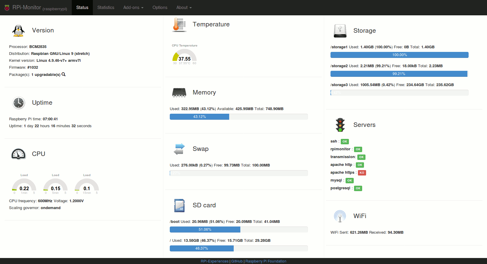

:github_url: https://github.com/XavierBerger/RPi-Monitor/blob/feature/docs/docs/source/01_features.rst

Keys features of RPi-Monitor
============================

At the beginning **RPi-Monitor** was designed to run on **Raspberry Pi**. This
is explaining the name of this software. In reality **RPi-Monitor** can run 
on every computers running `perl`.

Since the beginning **RPi-Monitor** as been designed for embedded devices and
performances is the core of development strategy. The software is divided into 
two main part:
 * A lightweight daemon running on the device and gathering data
 * A powerfull WEB application running in browser in charge of data rendering

Collecting metrics
------------------
  **rpimonitord** is a daemon wich periodically gather, process and store metrics.
  In **RPi-Monitor** metrics are named **KPI** for **K**\ ey **P**\ erformance **I**\ ndicator.

Storing metrics
---------------
  Metrics are stored into a `Round Robin Database <https://oss.oetiker.ch/rrdtool/>`_ (RRD). 
  This ensure a fixed size for the data storage and keep by default data over 1 year.

Presenting collected metrics
----------------------------
  **RPi-Monitor** embed a web server designed to present collected metrics.
  Instantaneous data are presented in the status page. Metrics stored in RRD
  are presented in statistics pages. 
  
  The web interface allow user to reorganise status information by drag'n drop. 
  
  Statistics page allow to zoom over graph to see details of the mertics.

  Embedded web server can be disable and pages can be served by an external web server.

Configurable
------------
  In **RPi-Monitor** everything is configurable:

  - Define what metrics to extract and how to extract them
  - Define how to store metrics
  - Define how to present and share metrics and statistics
  - Define how to detect an alert and what to do when alert appears or disappears
  - Define ... what you want to do with **RPi-Monitor**

  .. note:: See `configuration <10_index.html>`_ chapter for details and examples.
  
Processing metrics and raising alerts
-------------------------------------
  **RPi-Monitor** embed an alert engine fully configurable and able to determine
  if metrics are out of expected range and raise alerts.
  
  When an alert is detected, **RPi-Monitor** can execute an action. For example, sending email or SMS.

  Definition of critera of alert detection as well as action to perform when alert
  is detected are fully configurable.

Read only mode
--------------
  If writing data on disk/eMMC/SSD/SDCard/... is not possible, **RPi-Monitor** 
  can be executed in **read-only** mode. 
  
  Metrics can be retrived either by web interface in json format or through SNMP. 

Sharing metrics
---------------
  Metrics collected can be downloaded in json format (using the embedded web 
  server), read on disk or remotely accessed through SNMP.

Extending the capabilities
--------------------------
  **RPi-Monitor** is extensible. It provides addons allowing customisation of
  the interface `Shellinabox <https://github.com/shellinabox/shellinabox>`_, `Hawkeye <https://github.com/ipartola/hawkeye>`_, top3...

  **RPi-Monitor-Peeble** allows to see monitoring status on `Peeble <https://www.pebble.com/>`_ smart watch.
  
  **RPi-Monitor** is also available for `Docker <https://www.docker.com/>`_ and for embedded devices created
  with `Yocto Project <https://www.yoctoproject.org/>`_

`Screenshots <02_screenshots.html>`_
------------------------------------
  View **RPi-Monitor** in images in `screenshots <02_screenshots.html>`_ page.