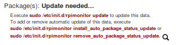

:github_url: https://github.com/XavierBerger/RPi-Monitor/blob/feature/docs/docs/source/02_gettingstarted.rst

First installation
==================

Installation from repository
----------------------------

**RPi-Monitor** is providing a debian repository. This repository makes 
installation and update accessible with the command ``apt-get`` or ``aptitude``.

To use this repository follow the instruction bellow:

Install **RPi-Monitor**'s public key to trust **RPi-Monitor** repository:

::

  sudo apt-get install dirmngr
  sudo apt-key adv --recv-keys --keyserver keyserver.ubuntu.com 2C0D3C0F

Execute the following command to add **RPi-Monitor** into your list of repository: 

::

  sudo wget http://goo.gl/vewCLL -O /etc/apt/sources.list.d/rpimonitor.list

To install **RPi-Monitor**, execute the following command:

::

  sudo apt-get update
  sudo apt-get install rpimonitor

.. hint:: **RPi-Monitor** is designed to start automatically and collect metrics.
          The web interface is available on address http://raspberrypi.local:8888.

.. note:: You may notice that **RPiMonitor** repository is hosted on 
          `http://giteduberger.fr/ <http://giteduberger.fr/en>`_

First step
----------

After first installation you will see the following message:

Execute the following command to update packages information

::

  sudo /etc/init.d/rpimonitor update

