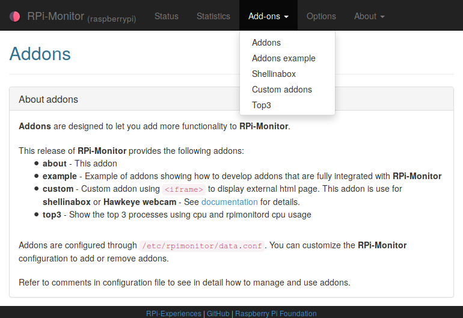
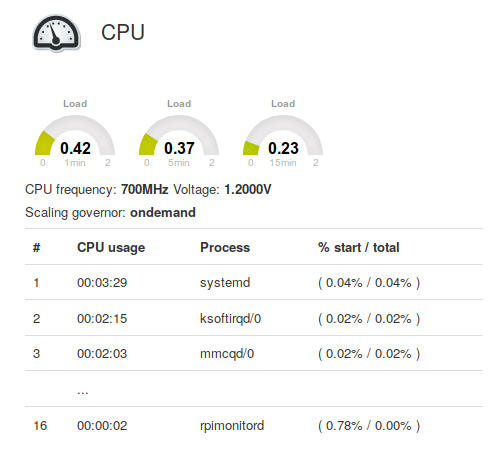
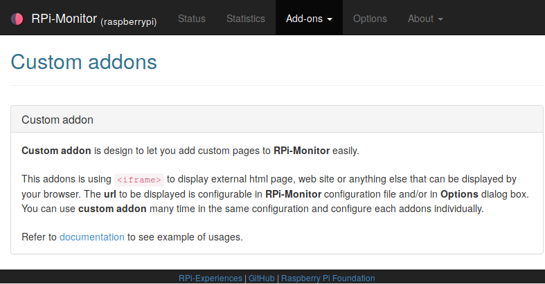
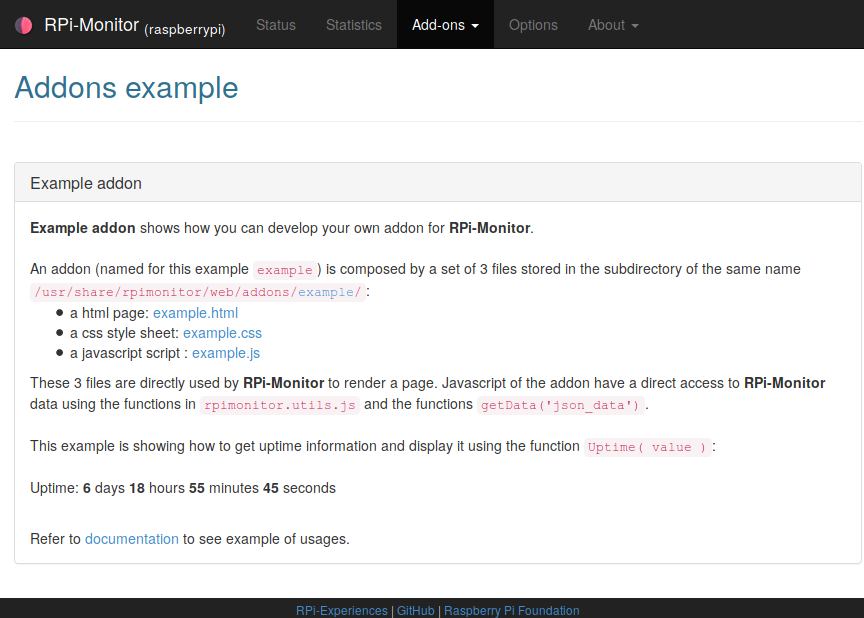

:github_url: https://github.com/XavierBerger/RPi-Monitor/blob/feature/docs/docs/source/24_addons.rst
:wip:

Addons configuration
====================

**RPi-Monitor** is providing addons. Addons are custom pages designed to give 
you the possibility to free your imagination and cutomise **RPi-Monitor** to your needs.

Addons are ``html`` pages, ``javascript`` and ``css`` directly integrated into **RPi-Monitor**.
The activation of an addon is done into **RPi-Monitor** configuration file.

It is possible to use an addon many time into a same configuration file using 
different parameters if the addon support them as show with `custom addon <24_addons.html#id3>`_.

The next part of this chapter shows some examples of addons and highlight the possibilities of this feature.

About Addon 
-----------

About addons is activated by default and present addons feature. 

To remove this addons, simply comment out or delete the following lines from ``/etc/rpimonitor/data.conf``.

::

  web.addons.1.title=Addons
  web.addons.1.addons=about

Top3 Addon 
----------

Top3 is showing how to use addons to add additionnal information into status page. 

This addons is designed to periodically generate HTML content. This content can be 
accessible from the addons menu and/or can be inserted into status page 
using the function ``InsertHTML()``.

Top3 addons shows the 3 process consuming the CPU time of CPU in addition to 
cunsumption of ``rpimonitord`` process.

To activate this addon, add the following lines to your configuration file
 
::

  web.addons.1.title=Top3
  web.addons.1.addons=top3

Copy ``/usr/share/rpimonitor/web/addons/top3/top3.cron`` to ``/etc/cron.d/top3`` to activate periodical check.

To add top3 information into status page, add the following line to configuration file.

::
  
  web.status.1.content.1.line.1=InsertHTML("/addons/top3/top3.html")

Custom Addon
------------

If you are not confortable with html, javascript and css, the addon custom may 
help you to customise **RPi-Monitor** to your wishes. This addons implement an 
iframe that can display any other web pages.

web.addons.<id>.title=<title>
  ``<title>`` represent the title displayed in addon menu or addon title
web.addons.<id>.addons=custom
  ``custom`` is the addon activated
web.addons.<id>.showtitle=<title visibility>
  ``<title visibility>`` define if title should be displayed or not
web.addons.<id>.url=<url>
  ``url`` is defining the page to be displayed into the iframe. It can be a file 
  reachable from **RPi-Monitor** internal server or a site available into the Internet.
web.addons.<id>.allowupdate=<allow update>
  ``<allow update>`` define is ``url`` can be updated in option

.. important:: ``id`` has to start by 1 and incrementing. This is defining the order of addons with the menu.

Shellinabox
^^^^^^^^^^^

`Shellinabox <https://github.com/shellinabox/shellinabox>`_ allow you to access to the shell of your 
Raspberry Pi through a web interface. 

Installing shellinabox can be done with the following command:
::

    apt-get install shellinabox

By default shellinabox listening on http://raspberrypi.local:4200/. 

Shellinabox can be integrated to **RPi-Monitor** with custom addon as follow:

::

  web.addons.1.title=ShelleInABox
  web.addons.1.addons=custom
  web.addons.1.showtitle=false
  web.addons.1.url=https://raspberrypi.local:4200/
  web.addons.1.allowupdate=false

Webcam 
^^^^^^

If you want to see the image of your webcam in your brower, you can use `hawkeye <https://github.com/ipartola/hawkeye>`_. 
Once hawkeye installed, it is very easy to add it into **RPi-Monitor** interface 
using the custom addon. The configuration will then be the following:

::

  web.addons.1.title=Webcam - Hawkeye
  web.addons.1.addons=custom
  web.addons.1.url=http://raspberrypi.local:8000/
  web.addons.1.allowupdate=false

``url`` parameter point to hawkeye web interface. 

.. danger:: If you are doing such a configuration, keep in mind about the 
            security of your images. You should use the capacity of hawkeye to 
            restrict the access to the image using a login and a password. 
            
            .. seealso:: You can also have a look to `Authentication and secure access to RPi-Monitor <34_autentication.html>`_.

Example Addon
-------------

If you want to develop your own addon, you can refer to the example addons to 
see how to implement such a feature.

Example addon is providing a ``html`` page, a ``javacript`` and a ``css`` showing 
how an addon page can interact with **RPi-Monitor**.  

Example addon can activate by adding the following lines into the configuration file:

::

  web.addons.1.title=Addon example
  web.addons.1.addons=example
  web.addons.1.showtitle=true
  web.addons.1.parameter=parameter_example
