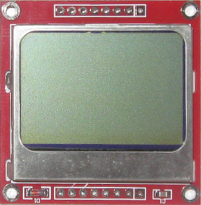
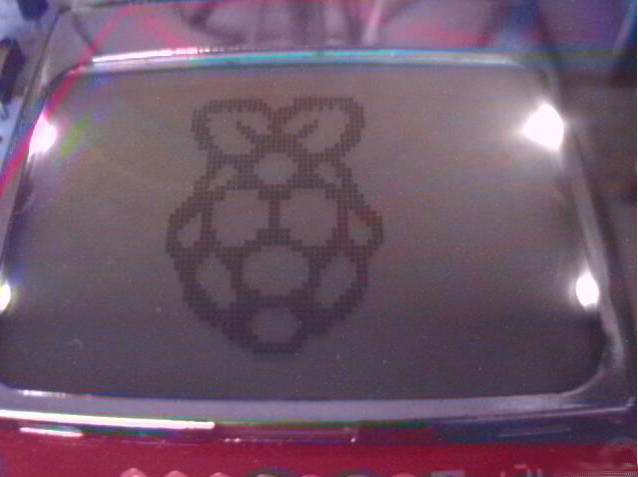
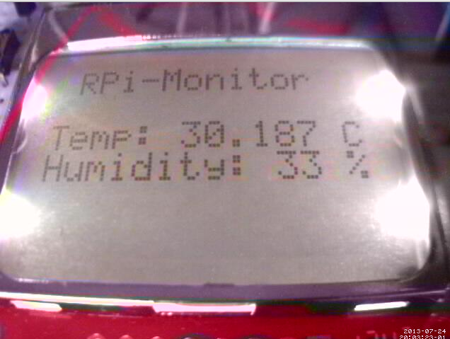

:github_url: https://github.com/XavierBerger/RPi-Monitor/blob/feature/docs/docs/source/25_lcd.rst

RPi-Monitor-LCD
===============

PCD8544 is a small and cheap LCD screen. We will see in this chapter how to use
it and connect it to **RPi-Monitor**.

LCD connection
--------------
PCD8544 comes in two parts (the lcd screen and the pins) that need to be 
soldered together. Once done, it can be installed in the breadboard as shown 
in the drawing bellow:

.. figure:: _static/lcd002.png
  :width: 400px 
  :align: center

  Schema made with Fritzing (fritzing.org)

.. note:: If you want to reproduce this assembly, check carefully the pin order, 
it may be different.

Preparation
-----------
My first goal is to test this new display. I look on the internet and find 
different solution using Python or C. After few tries, I decided to use 
Python based on the information shared into this post.

To use the PCD8544 display we need to install few software and load a
 kernel module.

First, let's install wiringpi2 from drogon.net

::

    git clone git://git.drogon.net/wiringPi
    cd wiringPi
    ./build

Once wiringpi is installed, it is possible to test it with the following command:

::

    gpio readall

+-----+-------+------+----+----------+----+------+-------+-----+
| wPi |  Name | Mode | Val| Physical |Val | Mode | Name  | wPi |
+=====+=======+======+====+====++====+====+======+=======+=====+
|     |  3.3v |      |    |  1 || 2  |    |      | 5v    |     |
+-----+-------+------+----+----++----+----+------+-------+-----+
|   8 |   SDA |   IN | Lo |  3 || 4  |    |      | 5V    |     |
+-----+-------+------+----+----++----+----+------+-------+-----+
|   9 |   SCL |   IN | Lo |  5 || 6  |    |      | 0v    |     |
+-----+-------+------+----+----++----+----+------+-------+-----+
|   7 | GPIO7 |   IN | Lo |  7 || 8  | Lo | ALT0 | TxD   | 15  |
+-----+-------+------+----+----++----+----+------+-------+-----+
|     |    0v |      |    |  9 || 10 | Lo | ALT0 | RxD   | 16  |
+-----+-------+------+----+----++----+----+------+-------+-----+
|   0 | GPIO0 |   IN | Hi | 11 || 12 | Hi | OUT  | GPIO1 | 1   |
+-----+-------+------+----+----++----+----+------+-------+-----+
|   2 | GPIO2 |   IN | Lo | 13 || 14 |    |      | 0v    |     |
+-----+-------+------+----+----++----+----+------+-------+-----+
|   3 | GPIO3 |   IN | Hi | 15 || 16 | Lo | OUT  | GPIO4 | 4   |
+-----+-------+------+----+----++----+----+------+-------+-----+
|     |  3.3v |      |    | 17 || 18 | Lo | OUT  | GPIO5 | 5   |
+-----+-------+------+----+----++----+----+------+-------+-----+
|  12 |  MOSI | ALT0 | Hi | 19 || 20 |    |      | 0v    |     |
+-----+-------+------+----+----++----+----+------+-------+-----+
|  13 |  MISO | ALT0 | Hi | 21 || 22 | Hi | IN   | GPIO6 | 6   |
+-----+-------+------+----+----++----+----+------+-------+-----+
|  14 |  SCLK | ALT0 | Hi | 23 || 24 | Lo | ALT0 | CE1   | 10  |
+-----+-------+------+----+----++----+----+------+-------+-----+
|     |    0v |      |    | 25 || 26 | Lo | ALT0 | CE1   | 11  |
+-----+-------+------+----+----++----+----+------+-------+-----+

Now, install the python binding of wiringpi:

::

    sudo apt-get install python-dev python-imaging python-imaging-tk python-pip
    sudo pip install wiringpi2

The program we will use require ``spidev`` to be activated. The kernel module 
should then be activated.

To do so, comment the line blacklist ``spi-bcm2708`` by adding a heading ``#``
in the file ``/etc/modprobe.d/raspi-blacklist.conf`` then reboot the 
Raspberry Pi to activate this module.

Finally install ``spidev`` python library:

::

    sudo pip install spidev

The prerequisite are now installed. In next chapter we will see how to install 
the python library in charge of driving the PCD8544 LCD and how to use it.

Installation
------------
Into Raspberry Pi forum, an interesting post catch my attention. I used it as 
the base to control the LCD.

The library written Richard Hull's is also interesting I then took this as a 
example to create module that can be directly installed on the Raspberry Pi.

This pcd8544 library resulting is available into its own dedicated repository 
in github.

To install it, execute the following commands:

::

    git clone https://github.com/XavierBerger/pcd8544.git 
    cd pcd8544
    ./setup.py clean build 
    sudo ./setup.py install

 You can now test the installation with the proposed examples:

::

    cd examples
    ./pi_logo.py

If installation works properly, you should see the following screen:

You can try to execute other examples to see what the library is capable to do with this LCD.

Usage
-----
As I said in introduction, RPi-Monitor is gathering a lot of information and 
some of them may be interesting to have without having to start a PC. 
Information are made available from the embedded web server. To get and 
display the information we then just have to create a web client and use 
the library to display.

For people interesting about learning development I did comment my code:

.. code-block:: python

  #!/usr/bin/env python
  import httplib, time, os, sys, json
  import pcd8544.lcd as lcd

  # class Process dedicated to process data get from Client
  # and send information to LCD and console
  class Process:
    # Process constructor
    def __init__(self):
      # Initialize LCD
      lcd.init()
      # Turn the backlight on
      lcd.backlight(1)

    def run(self, jsonString):
      # Parse data as json
      data = json.loads( jsonString )
      # Try to get data from json or return default value 
      try:
        rpi_temperature = data['living_room_temp']
      except:
        rpi_temperature="--.---"
      try:
        rpi_humidity = data['humidity']
      except:
        rpi_humidity = "--"
      # Construct string to be displayed on screens
      temperature = "Temp: %s C" % rpi_temperature
      humidity = "Humidity: %s %%" % rpi_humidity
      lcd.gotorc(0,1)
      lcd.text("RPi-Monitor")
      lcd.gotorc(2,0)
      lcd.text(temperature)
      lcd.gotorc(3,0)
      lcd.text(humidity)
      # Also print string in console
      os.system("clear")
      print " RPi-Monitor "
      print
      print temperature
      print humidity
      print
      time.sleep(1)

  # Class client design to work as web client and get information 
  # from RPi-Monitor embedded web server
  class Client:
    # Client constructor
    def __init__(self):
      # Create a Process object
      self.process = Process()

    def run(self):
      # Infinite loop
      while True:
      try:
        # Initiate a connection to RPi-Monitor embedded server
        connection = httplib.HTTPConnection("localhost", 8888)
        # Get the file dynamic.json
        connection.request("GET","/dynamic.json")
        # Get the server response
        response = connection.getresponse()
        if ( response.status == 200 ):
          # If response is OK, read data
          data = response.read()
          # Run process object on extracted data
          self.process.run(data)
        # Close the connection to RPi-Monitor embedded server
        connection.close()
      finally:
        # Wait 5 secondes before restarting the loop
        time.sleep(5)

  # Main function
  def main():
    try:
      # Create a Client object
      client = Client()
      # Run it
      client.run()
    except KeyboardInterrupt:
      # if Ctrl+C has been pressed
      # turn off the lcd backlight
      lcd.backlight(0); 
      # exit from the program 
      sys.exit(0)

  # Execute main if the script is directly called
  if __name__ == "__main__":
      main()

This code is dedicated to extract the living room temperature and humidity 
from RPi-Monitor information.

Copy this code into a file ``rpimonitor-testlcd.py`` the make this file 
executable ``chmod +x rpimonitor-testlcd.py`` then execute ``./rpimonitor-testlcd.py`` it to see:

