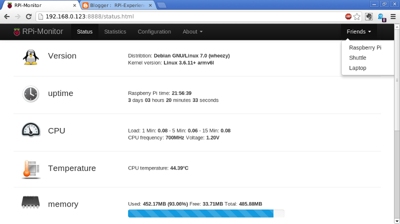
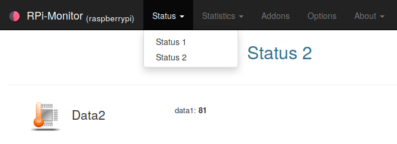
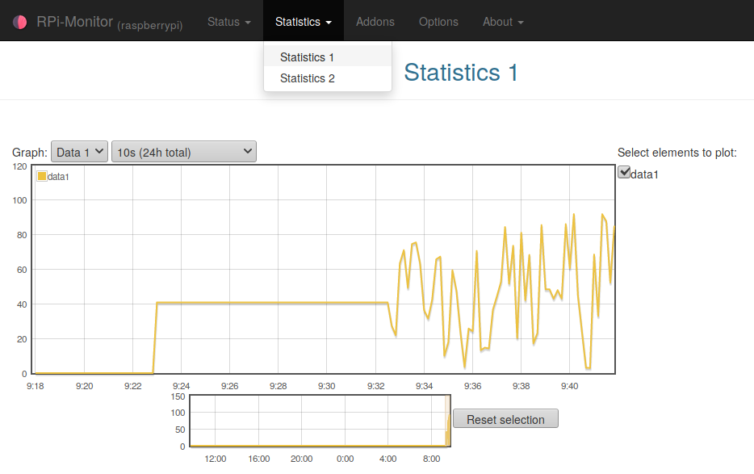
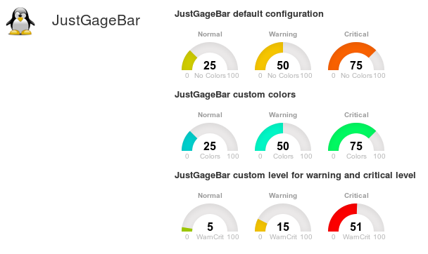
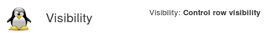
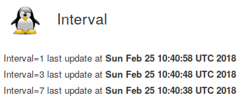
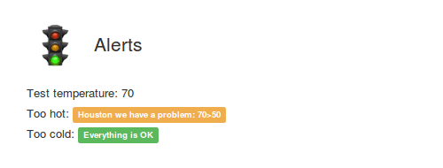

:github_url: https://github.com/XavierBerger/RPi-Monitor/blob/feature/docs/docs/source/31_customisation.rst

Configuration templates
=======================

**RPi-Monitor** comes with example files showing the capabilities of some features 
and functions available in status page. 
These files are installed into ``/etc/rpimonotor/templates/``
To see how a specific file is behaving, you can include this file into your 
configuration file using the ``include``. 

.. hint:: By default, files are included and commented out into ``data.conf``. 
          To activate them, you can simply uncomment them and restart ``rpimonitord``.

.. note:: Remember to restart RPi-Monitor to apply the configuration change:
  
  ::

    sudo /etc/init.d/rpimonitor restart

Page header
-----------

This function allow to define a custom logo, custom title.

Here is and example of configuration : ``/etc/rpimonitor/template/example.header.conf``

.. include:: ../../src/etc/rpimonitor/template/example.header.conf
  :literal:

``data.hostname`` is a value automatically extracted by **RPi-Monitor**. It is not 
needed to add a configuration.

The file ``avatar.png`` has been added into ``/usr/share/rpimonitor/web/img/``.

Here is the result:

.. figure:: _static/header001.png
   :align: center
   :width: 500px

.. seealso:: See defails in `Header customisation  <13_web.html#header-customisation>`_

Friends
-------

Add "friends" links **RPi-Monitor** running on different platform together.

A friend is simply another computer running **RPi-Monitor**. Configuring friends 
will add a drop down list on the right of the top menu with a links to 
**RPi-Monitor** sitting on the other computer.

Each friend is identified by an ``id`` and is described by 2 parameters: ``<title>`` and ``<link>``.

Here is an example of configuration : ``/etc/rpimonitor/template/example.friends.conf``

.. include:: ../../src/etc/rpimonitor/template/example.friends.conf
   :literal:

.. figure:: _static/friends002.png
   :align: center

.. seealso:: See details in `Friends definition  <23_web.html#friends>`_

Badges and labels
-----------------

The functions ``Label`` and ``Badge`` are designed to write a text highligted by a color base on condition.

Here is an example of configuration : ``/etc/rpimonitor/template/example.badge_and_label.conf``

.. include:: ../../src/etc/rpimonitor/template/example.badge_and_label.conf
   :literal:

In this example, we monitor if the service ``ssh`` is listening on port ``22`` and display a 
label ``OK`` if yes or a label ``KO`` if not.

We do the same for **RPi-Monitor** on port ``8888`` and for ``nginx`` on port ``80`` and ``443``.

Information is extracted from the command ``netstat``.

The regular expression will return the port number if a service is listening 
on this port or nothing if no service is listenning on this port.

The results are accessible into javascript from the variable data. This 
variable is passed to the Label function as value.

For ssh, the condition is ``"==22"`` to check if the value is equal to 
``22`` or ``"!=22"`` to check if the value is different form ``22``. As only one of 
the condition will be ``true``, only one label will be displayed.

Other ports checking are using the same technic.

Here is the result:

.. image:: _static/label001.png
  :align: center

Multiple pages
--------------

Status and statistics can be sorted in pages. The parameter ``<page id>`` of
``web`` configuration is defining in which page data is displayed.

Here is an example of configuration : ``/etc/rpimonitor/template/example.multipage.conf``

.. include:: ../../src/etc/rpimonitor/template/example.multipage.conf
   :literal:

The new page will be accessible by a drop down menu as shown in the screenshot bellow.

   **RPi-Monitor** showing multiple status pages

   **RPi-Monitor** showing multiple graph pages

Progress bar
------------

The functions ``ProgressBar`` are designed to draw a progress bar. Default color is bleu.
Color can change base on **warning** and **danger** thresholds.

Here is an example of configuration : ``/etc/rpimonitor/template/example.progressbar.conf``

.. include:: ../../src/etc/rpimonitor/template/example.progressbar.conf
   :literal:

Here is the result:

    Show warning and critical and colors 

JustGageBar
-----------

Justgage is a handy JavaScript plugin for generating and animating nice & clean gauges. 
It is based on Raphaël library for vector drawing, so it’s completely resolution independent and self-adjusting.

Here is an example of configuration : ``/etc/rpimonitor/template/example.justgage.conf``

.. include:: ../../src/etc/rpimonitor/template/example.justgage.conf
   :literal:

Here is the result:

.. figure:: _static/web002.png
    :width: 400px 
    :align: center

    Show warning and critical and colors 

Visibility
----------

Visibility parameter define if a row should be displayed or not. It could be usefull 
for monitoring of an external disk which could be disconnected.

Here is an example of configuration : ``/etc/rpimonitor/template/example.visibility.conf``

In this example, the row is alternativelly dosplayed and hide depending on minute parity.

.. include:: ../../src/etc/rpimonitor/template/example.visibility.conf
   :literal:

Here is the result:

    Show visibility feature

Interval
--------

Interval parameter define when data should be extracted. By defaut an interval is 10 sec.
Sometime it is usefull to extract data less frequently. Setting `interval` to 3 will 
extract data every 30sec. 

Here is an example of configuration : ``/etc/rpimonitor/template/example.interval.conf``

In this example is showing interval set tj 1, 3 and 7

.. include:: ../../src/etc/rpimonitor/template/example.interval.conf
   :literal:

Here is the result:

Alerts
------

**RPi-Monitor** is embedding a mechanism of alerts. The idea is to execute a 
script when a KPI reach a limit. To avoid executing this script to frequently, 
some timer have to be configured.
The file ``example.alert.conf`` show how to configure alerts.  

.. include:: ../../src/etc/rpimonitor/template/example.alert.conf
   :literal:

The first part defines dynamic data and how **RPi-Monitor** should do to extract 
information from the file ``/tmp/alert_test``.

These data are added in statistics page (``web.statistics.1.[...]``) to graphs the temperature. 

Then we configure 2 alerts ``too_hot`` and ``too_cold``. Let's see how ``too_hot`` is configured

The alert will be evaluated only when it will become active, when ``active`` parameter will be evaluate to ``true``. 
In this example 120 seconds after computer starts: ``alert.too_hot.active=data.uptime>120``.

When the alert is active, the trigger is evaluated. In this example, when test 
if the value of ``test_alert`` is greater than 50: ``alert.too_hot.trigger=data.test_alert>50``.

When the trigger returns ``true`` during ``maxalertduration`` seconds (20 seconds), the command 
``commandTooHot`` is executed.
If the trigger is still true after ``resendperiod`` seconds after (60 seconds), the command 
``raisecommand`` is executed again.

When the trigger become ``false`` during ``cancelvalidation`` seconds (20 seconds), the  command 
``cancelcommand`` is executed. 

Into the example file, you can see how these data are used to display label on status page. 
You will see that limit exceed is immediately detected and see alert send after the defined delay.

To simulate a temperature monitoring and see how this configuration can raise and clear alerts, execute 
the following commands to generate data:

::

    while ( true ); do echo $(( ( RANDOM % 100 ) - 20 )) > /tmp/test_alert; sleep 90; done

Execute the following command  to see alerts

::

    watch 'grep ".*" /tmp/test_alert.*'
    
Open the status page and check the auto update option to see the example running in real time as shown bellow:

