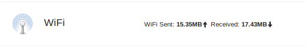
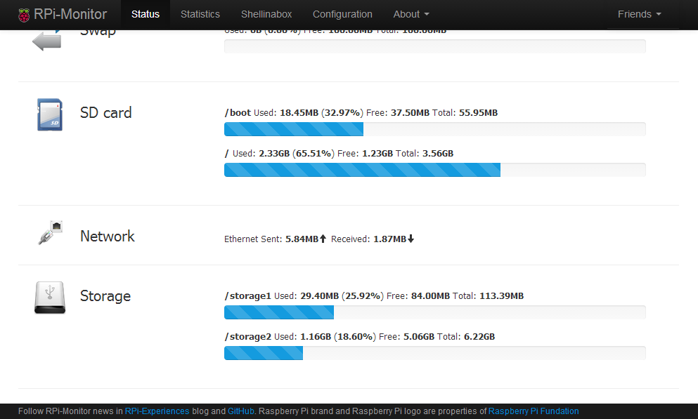
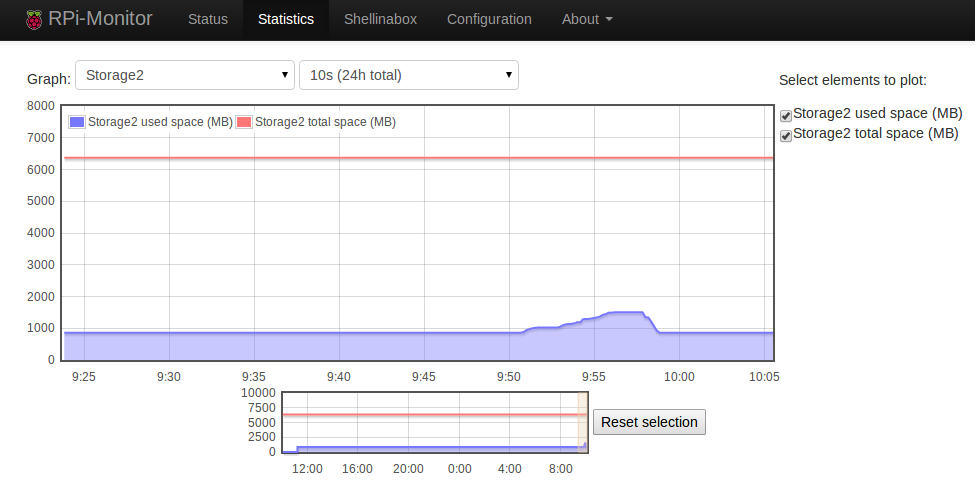
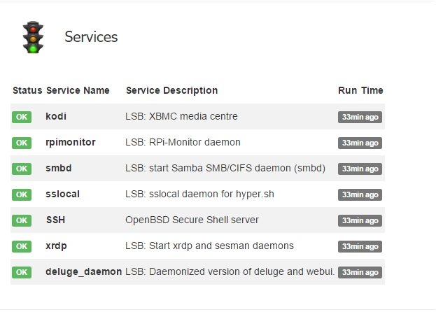
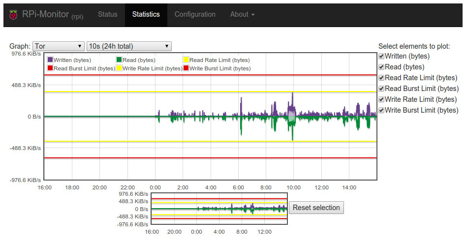

:github_url: https://github.com/XavierBerger/RPi-Monitor/blob/develop/docs/source/31_configuration_examples.rst
:wip:

Configuration examples
======================

Monitoring a WiFi network
-------------------------

The following configuration is showing how to configure the monitoring WiFi
interface ``wlan0``

To extract metrics representing the trafic on the interface we need to create 
a ``dynamic`` configuration to collect data in pseudo file system 
``/sys/class/net/wlan0/statistics/``. 

Collecting metrics
^^^^^^^^^^^^^^^^^^

::

    dynamic.1.name=wifi_received
    dynamic.1.source=/sys/class/net/wlan0/statistics/rx_bytes
    dynamic.1.regexp=(.*)
    dynamic.1.postprocess=$1*-1
    dynamic.1.rrd=DERIVE

    dynamic.2.name=wifi_send
    dynamic.2.source=/sys/class/net/wlan0/statistics/tx_bytes
    dynamic.2.regexp=(.*)
    dynamic.2.postprocess=
    dynamic.2.rrd=DERIVE

.. note:: We dicided to represent downstream data with negative values. This is
          performed by the postprocess command: ``$1*-1``

Add status
^^^^^^^^^^

The collected metrics will be displayed in ``status`` page as define in the 
configuration bellow:

::

    web.status.1.content.1.title=WiFi
    web.status.1.content.1.icon=wifi.png
    web.status.1.content.1.line.1="WiFi Sent: <b>"+KMG(data.wifi_send)+"<i class='icon-arrow-up'></i></b> Received: <b>"+KMG(Math.abs(data.wifi_received)) + "<i class='icon-arrow-down'></i></b>"

Add statistics
^^^^^^^^^^^^^^

The following configuration add one graph to statistics page with the 2 curves 
representing upstream and downstream metrics:

::

    web.statistics.1.content.1.title=WiFi
    web.statistics.1.content.1.graph.1=wifi_send
    web.statistics.1.content.1.graph.2=wifi_received
    web.statistics.1.content.1.ds_graph_options.wifi_send.label=Upload bandwidth (bits)
    web.statistics.1.content.1.ds_graph_options.wifi_send.lines={ fill: true }
    web.statistics.1.content.1.ds_graph_options.wifi_send.color="#FF7777"
    web.statistics.1.content.1.ds_graph_options.wifi_received.label=Download bandwidth (bits)
    web.statistics.1.content.1.ds_graph_options.wifi_received.lines={ fill: true }
    web.statistics.1.content.1.ds_graph_options.wifi_received.color="#77FF77"

In this configuration, we set color to green for downstream and red for upstream. 
The curves are filled.

.. important:: To apply the configuration, it is required to restart **RPi-Monitor** : ``/etc/init.d/rpimonotird restart``

Monitor external disk
---------------------

The disk have a disk with two partition ``/dev/sda1`` and ``/dev/sda3``.

The command and regular expression will be the following:

* sda1 disk size command : ``df -t ext2,  regular expression: sda1\s+(\d+)``
* sda1 used space command : ``df -t ext2,  regular expression: sda1\s+\d+\s+(\d+)``
* sda3 disk size command : ``df -t ext4,  regular expression: sda3\s+(\d+)``
* sda3 used space command : ``df -t ext4,  regular expression: sda3\s+\d+\s+(\d+)``

First we need to configure the extraction of partitions sizes which are extracted once at RPi-Monitor startup. We will create a file /etc/rpimonitord.conf.d/custo.conf with the data configured as static data like this:

::

    static.1.name=storage1_total 
    static.1.source=df -t ext2 
    static.1.regexp=sda1\s+(\d+) 
    static.1.postprocess=$1/1024

    static.2.name=storage2_total 
    static.2.source=df -t ext4 
    static.2.regexp=sda3\s+(\d+) 
    static.2.postprocess=$1/1024

The post processing is configured to transform kB into MB by dividing the extracted result by 1024.

For dynamic values extracted every 10 seconds, the configuration will be:

::

    dynamic.1.name=storage1_used 
    dynamic.1.source=df -t ext2 
    dynamic.1.regexp=sda1\s+\d+\s+(\d+) 
    dynamic.1.postprocess=$1/1024 
    dynamic.1.rrd=GAUGE 

    dynamic.2.name=storage2_used 
    dynamic.2.source=df -t ext4 
    dynamic.2.regexp=sda3\s+\d+\s+(\d+) 
    dynamic.2.postprocess=$1/1024 
    dynamic.2.rrd=GAUGE

Dynamic stat will be stored into a RRD File as GAUGE. Ref to RRDTool help for detail about Data Source Types.

Now we will add a status line for this disk whit the following icon:

This icons has to be installed into the img directory of **RPi-Monitor** which is 
by default ``/usr/share/rpimonitor/web/img/``.

The configuration to add a new status strip will then be the following:

::    

    web.status.1.content.1.title=Storage 
    web.status.1.content.1.icon=usb_hdd.png 
    web.status.1.content.1.line.1="<b>/storage1</b> Used: <b>"+KMG(data.storage1_used,'M')+"</b> (<b>"+Percent(data.storage1_used,data.storage1_total,'M')+"</b>) Free: <b>"+KMG(data.storage1_total-data.storage1_used,'M')+ "</b> Total: <b>"+ KMG(data.storage1_total,'M') +"</b>" 
    web.status.1.content.1.line.2=ProgressBar(data.storage1_used,data.storage1_total) 
    web.status.1.content.1.line.3="<b>/storage2</b> Used: <b>"+KMG(data.storage2_used,'M')+"</b> (<b>"+Percent(data.storage2_used,data.storage2_total,'M')+"</b>) Free: <b>"+KMG(data.storage2_total-data.storage2_used,'M')+ "</b> Total: <b>"+ KMG(data.storage2_total,'M') +"</b>"

The configuration may need some explanation:

We do configure 4 lines. Each line is describing a javascript line using some 
predefined functions: KMG, Precent and ProgressBar. This function are called by 
the browser while rendering the page. Some variable coming from the extracted 
data are also used. These variables are starting by the keyword ``data``. For 
deeper detail about this configuration execute the command man rpimonitord.conf

To see our modification we need to restart **RPi-Monitor** and refresh the 
statistics page into our browser.

::

    sudo  service rpimonitor restart

The result of the configuration is at the bottom of the following screenshot:

The status page is working, let's now add a graphic of the disk usage. 
This is done with the following configuration:

::

    web.statistics.1.content.1.title=Storage1 
    web.statistics.1.content.1.graph.1=storage1_total 
    web.statistics.1.content.1.graph.2=storage1_used 
    web.statistics.1.content.1.ds_graph_options.storage1_total.label=Storage1 total space (MB) 
    web.statistics.1.content.1.ds_graph_options.storage1_total.color="#FF7777" 
    web.statistics.1.content.1.ds_graph_options.storage1_used.label=Storage1 used space (MB) 
    web.statistics.1.content.1.ds_graph_options.storage1_used.lines={ fill: true } 
    web.statistics.1.content.1.ds_graph_options.storage1_used.color="#7777FF" 

    web.statistics.1.content.2.title=Storage2 
    web.statistics.1.content.2.graph.1=storage2_total 
    web.statistics.1.content.2.graph.2=storage2_used 
    web.statistics.1.content.2.ds_graph_options.storage2_total.label=Storage2 total space (MB) 
    web.statistics.1.content.2.ds_graph_options.storage2_total.color="#FF7777" 
    web.statistics.1.content.2.ds_graph_options.storage2_used.label=Storage2 used space (MB) 
    web.statistics.1.content.2.ds_graph_options.storage2_used.lines={ fill: true } 
    web.statistics.1.content.2.ds_graph_options.storage2_used.color="#7777FF"

The configuration may also need some explanation

We do configure 2 graphs each having 2 curves. The first curve represent the 
total and is using static data extracted previously. This curve will be represented as a light red line.

The second curve is representing the usage of disk and is represented as a 
light blue line filled. The parameters defining the curve are define by the keyword 
ds_graph_options. Details of this parameter can be found in javascriptrrd help page. 
Restart rpimonitor to activate the new graph.

After waiting a little time to let the system extract data you will see this kind of graph.

Advanced service monitoring configuration
-----------------------------------------
Here is an example of configuration proposed by Münir Ozan TOPCU:

.. include:: ../../src/etc/rpimonitor/template/advanced_service.conf
   :literal:

Here is the result:

Monitor rclone
--------------

.. todo:: write this section

Use MRTG with RPi-Monitor in read-only mode
--------------------------------------------

.. todo:: write this section

Monitor a TOR relay 
-------------------
Here is an example of configuration proposed by Luiz Kill: on `tor-info <https://github.com/lzkill/tor-info>`_

.. include:: ../../src/etc/rpimonitor/template/tor.conf
   :literal:

Here is the result:

