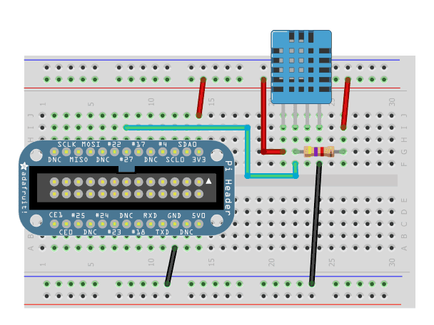
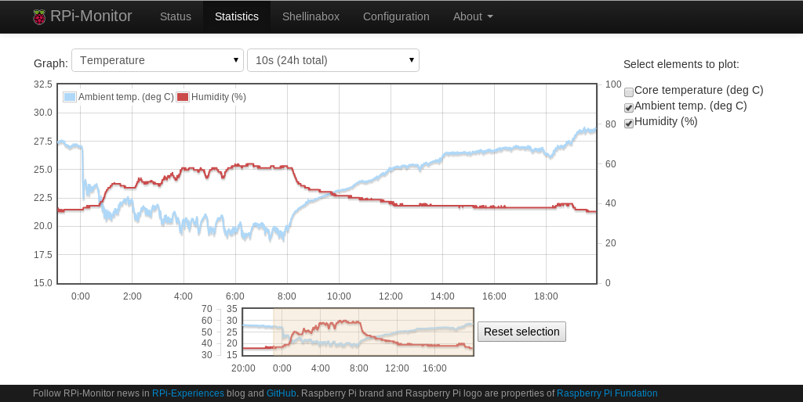

:github_url: https://github.com/XavierBerger/RPi-Monitor/blob/feature/docs/docs/source/34_sensors.rst
:wip:

Configuration using sensors
===========================

DHT11 temperature and humidity sensor
-------------------------------------

Overview
^^^^^^^^
In this chapter we will see how to connect a DHT11 or DHT22 Temperature and
Humidity sensor and configure **RPi-Monitor** to present and draw the outputs.

We will also see how to steup dual-axis.

.. seealso:: Adafruit created a very good tutorial explaining how to use DHT11 or DHT22.

             This tutorial is available at this `here <http://learn.adafruit.com/dht-humidity-sensing-on-raspberry-pi-with-gdocs-logging/wiring>`_.

Electronic assembly
^^^^^^^^^^^^^^^^^^^

This electronic assembly is quite simple and will need:

* 1 x DHT11 or 1 x DHT22
* 1 x 4.7k resistor

Plug them as described in the following schema:

  
  Schema extracted from Adafruit but using GPIO #27 instead of GPIO #4

Software installation
^^^^^^^^^^^^^^^^^^^^^

Thanks to Adafruit ( again ;-) ) the installation is quite simple and can be 
done with two command lines.

Download Adafruit_DHT form Adafruit's github repository and copy is in ``/usr/bin`` as follow:

::

    wget http://goo.gl/oadpl -O Adafruit_DHT
    sudo cp Adafruit_DHT /usr/bin/

To test the electronic assembly and the software installation execute the 
following command (for DHT11):

:: 

    pi@raspberrypi ~ $ sudo Adafruit_DHT 11 27
    Using pin #17Data (40): 0x28 0x0 0x18 0x0 0x40
    Temp = 24 *C, Hum = 40 %

You should see the information about temperature and humidity displayed as shown upper.

.. note:: The DHT11 and DHT22 sensors will only respond every second so if you 
          are not getting data, be sure to wait few seconds before trying again.

RPi-Monitor configuration
^^^^^^^^^^^^^^^^^^^^^^^^^
Let's now use this information and add humidity graphs on existing temperature graph.

We first have to extract the data. This is done like this:

::

    dynamic.1.name=humidity 
    dynamic.1.source=Adafruit_DHT 11 27 
    dynamic.1.regexp=Hum = (\S+) 
    dynamic.1.postprocess= 
    dynamic.1.rrd=GAUGE

We will now add the humidity curve into the graph of temperature. 
This can be done with the configuration bellow:

::

    web.statistics.1.content.1.title=humidity 
    web.statistics.1.content.1.ds_graph_options.humidity.label=Humidity (%) 
    web.statistics.1.content.1.ds_graph_options.humidity.yaxis=2 
    web.statistics.1.content.1.graph_options.y2axis={ position: "right", min: 0, max: 100 }

As the unit are different than the one existing on the initial axis, 
we will add a second axis for the percentage of humidity. This is the purpose 
of the two last lines of the configuration bellow.

The first line is defining the usage of axis number 2 for the humidity.

The last line is defining how this graph should be drawn: On the right, 
starting from 0 up to 100.

``graph_options`` can have other usefull option. They are described in the 
documentation of `javascriptrrd <http://javascriptrrd.sourceforge.net/docs/javascriptrrd_v0.6.3/doc/lib/rrdFlot_js.html>`_.

After restarting RPi-Monotor with the command:

:: 

    service rpimonitor restart

You will see a new curve in Temperature graph as shown in the screenshot bellow:

  
  Graph with 2 Y axis: °C in left axis and % humidity (fixed from 0% to 100%) 
  on right axis

|
|
|
|
| OLD CONF: TO BE REVIEWED 
|
|
|
|

DS18B20 1wire temperature sensor
--------------------------------

Add other graphs from additional sources: external temperature probe

Let's build a little electronic device to measure the room temperature and add this in the temperature graph.
Do do that, you will need:

    1 x DS18B20
    1 x 4.7k resistor

Plug them as described in the following schema extracted from Adafruit Lesson 11:

Lets first load the kernel module required to get the information from this probe:
    sudo modprobe gpio
    sudo modprobe w1-gpio
    sudo modprobe w1-therm

First we have to identify the id of our probe:
    ls /sys/bus/w1/devices/
    28-000004fe1847  w1_bus_master1

the id is: 28-000004fe1847. Let's now check if we can get the temperature:
    cat /sys/bus/w1/devices/28-000004fe1847/w1_slave
    5a 01 4b 46 7f ff 06 10 a3 : crc=a3 YES
    5a 01 4b 46 7f ff 06 10 a3 t=21625

It looks to work. So now we need to extract the the numbers ending the second line (21625). The regular expression will then be t.(\d+)$. I'll not do a course about what a regexp is there are many site on the internet explaining it.
Note: In version 1.x of RPi-Monitor it is prohibited to use = in regular expression.

To add a graph to RPi-Monitor statistic, we need to create a new section. Let's call it 
[room_temperature]. Then we have to declare the new data name room_temp, its source 
/sys/bus/w1/devices/28-000004fe1847/w1_slave and the associated regular expression t.(\d+)$.
The line to append will look like that:

    # Room temperature
    [room_temperature]
    room_temp=/sys/bus/w1/devices/28-000004fe1847/w1_slave=t.(\d+)$

Restart RPi-Monitor with the following command and it is done:
    sudo  service rpimonitor restart

A new graph is available in statistics (wait a little bit to have data and drawing):

Use zoom feature to see the freshly added data.
If you want to add a curve into the Temperature graph, it is possible by adding 
the KPI line into the section [temperature] as describe bellow:

    [temperature]
    soc_temp=/sys/devices/virtual/thermal/thermal_zone0/temp=(.*)
    home_temp=/sys/bus/w1/devices/28-000004fe1847/w1_slave=t.(\d+)$

It will then be required to delete the associated rrd file:
    sudo rm /usr/share/rpimonitor/web/stat/temperature.rrd

Restarting RPi-Monitor will regenerate this file with the two describes temperature. After waiting some time to let data to be added, you will have a graph with two temperatures as in the screenshot bellow:

soc_temp and home_temp drawn on the same graph

