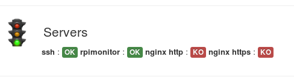

Customisation
=============

Multiple pages
--------------

This version of RPi-Monitor introduce the notion of pages. Adding a new page 
can be done in configuration file by setting the parameter named <page id>.
RPi-Monitor will automatically interpret this new id and create the associated 
page. The new page will be accessible by a drop down menu as shown in the 
screenshot bellow.

RPi-Monitor showing multiple status pages

RPi-Monitor showing multiple graph pages

The file custo.conf available in github shows how to configure additional pages 
from information gathered from external sensors. This is the configuration file
 used for the examples shows in upper screenshots.

Labels
------

The goal of this function is to add a colored text reflecting the status of a service.

Label funtion overview
^^^^^^^^^^^^^^^^^^^^^^

The function Label is designed to write a text highligted by a color.

::

    Label(value, condition, text, level) 

This function determine if the label has to be displayed ot not base on a value
 (extracted by **RPi-Monitor**) and a condition. The label contains a text to 
 be displayed and a level. 6 levels of labels are available with 6 differences colors:

How to use it?
^^^^^^^^^^^^^^

The file ``/etc/rpimonitor/template/services.conf`` is showing an example of Label usage.

In this example, we monitor if the service ``ssh`` is listening on port ``22`` and display a 
label ``OK`` if yes or a label ``KO`` if not.

We do the same for **RPi-Monitor** on port ``8888`` and for ``nginx`` on port ``80`` and ``443``.

::

    ######################################################################## 
    # External daemons information added into Raspberry Pi page # icon from: 
    # http://www.iconseeker.com/search-icon/crystal-project-application/daemons.html 
    ######################################################################## 
    dynamic.16.name=ssh dynamic.16.source=netstat -nlt 
    dynamic.16.regexp=tcp .*:(22).*LISTEN 
    dynamic.17.name=rpimonitor 
    dynamic.17.source=netstat -nlt 
    dynamic.17.regexp=tcp .*:(8888).*LISTEN 
    dynamic.18.name=http 
    dynamic.18.source=netstat -nlt 
    dynamic.18.regexp=tcp .*:(80).*LISTEN 
    dynamic.19.name=https 
    dynamic.19.source=netstat -nlt 
    dynamic.19.regexp=tcp .*:(443).*LISTEN 
    web.status.1.content.9.name=Servers 
    web.status.1.content.9.icon=daemons.png 
    web.status.1.content.9.line.1="<b>ssh</b> : "+Label(data.ssh,"==22","OK","label-success")+Label(data.ssh,"!=22","KO","label-important")+" <b>rpimonitor</b> : "+Label(data.rpimonitor,"==8888","OK","label-success")+Label(data.rpimonitor,"!=8888","KO","label-important")+" <b>nginx http</b> : "+Label(data.http,"==80","OK","label-success")+Label(data.http,"!=80","KO","label-important")+" <b>nginx https</b> : "+Label(data.https,"==443","OK","label-success")+Label(data.https,"!=443","KO","label-important")

How does it work?
^^^^^^^^^^^^^^^^^

Information is extracted from the command ``netstat``.

The regular expression will return the port number if a service is listening 
on this port or nothing if no service is listenning on this port.

Note: these regular expression may be optimised to return more accurrate result.

The results are accessible into javascript from the variable data. This 
variable is passed to the Label function as value.

For ssh, the condition is ``"==22"`` to check if the value is equal to 
``22`` or ``"!=22"`` to check if the value is different form 22. As only one of 
the condition will be ``true``, only one label will be displayed.

Other ports checking are using the same technic.

Example of Label function used to show server status

As you see, the usage of this new function is quite easy. You can now 
imagine how to use it for your own needs.

Friends
-------

Add "friends" linking RPi-Monitor running on different platform together

Friends is a notion that comes in version 1.2. A friend is simply another computer running RPi-Monitor. Configuring friends will add a drop down list on the right of the top menu with a links to RPi-Monitor sitting on the other computer.

Friends menu is visible on the top right

In /etc/rpimonitord.conf.d/default.conf, each friend is identified by its and is described by the 2 following parameters:

Here is an example of configuration for 3 friends:

::

  web.friends.1.name=Raspberry Pi web.friends.1.link=http://192.168.0.123/ 
  web.friends.2.name=Shuttle web.friends.2.link=http://192.168.0.2/ 
  web.friends.3.name=Laptop web.friends.3.link=http://192.168.0.38/

Add "friends" linking RPi-Monitor running on different platform together

Friends is a notion that comes in version 1.2. A friend is simply another computer running RPi-Monitor. Configuring friends will add a drop down list on the right of the top menu with a links to RPi-Monitor sitting on the other computer.

Friends menu is visible on the top right

In /etc/rpimonitord.conf.d/default.conf, each friend is identified by its and is described by the 2 following parameters:

Here is an example of configuration for 3 friends:

:: 

  web.friends.1.name=Raspberry Pi 
  web.friends.1.link=http://192.168.0.123/ 
  web.friends.2.name=Shuttle 
  web.friends.2.link=http://192.168.0.2/ 
  web.friends.3.name=Laptop 
  web.friends.3.link=http://192.168.0.38/

Customise WEB page header
-------------------------

This new function allow to define a custom logo, custome title and add the 
hostname of the machine int the title of the browser.

Here are the configuration lines used by default:

  web.page.icon='img/avatar.png'
  web.page.menutitle='XB-Monitor  ('+data.hostname+')'
  web.page.pagetitle='XB-Monitor ('+data.hostname+')'

data.hostname is a value automatically extracted by RPi-Monitor. It is not 
needed to add a configuration to do such a thing.

The file avatar.png has been added into /usr/share/rpimonitor/web/img/.

Here is the result:

Inside Firefox title bar and tab, the title has been changed and hostmane 
has been added between parentheses.
Inside RPi-Monitor menu bar, le logo and the title have been changed and 
hostmane has been added between parentheses. 

JustGageBar
-----------

A new widget is now available to display information in status page. Justgage is a handy JavaScript plugin for generating and animating nice & clean gauges. It is based on Raphaël library for vector drawing, so it’s completely resolution independent and self-adjusting.

  JustGageBar(title, label,min, value, max, width, height, levelColors, warning, critical)
 
To see how justgage behave, you can activate the configuration file example.justgage.conf (Ref example explaination and screenshot upper).

The detail of function usage is available into the manpage:

  man rpimonitord.conf

visibility
----------

A new parameter can be used in configuration file defining a visibility of a row:

  web.status.<page id>.content.<row id>.visibility=<visibility formula>

<visibility formula> should be a valid javascript formula returning
          0: to hide the row
          anything else but 0: show the row

Example files
-------------

RPi-Monitor comes with example files showing the capabilities of some features 
and functions available in status page. To see how a specific file is behaving,
you can include this file into your configuration file using the 'include' 
directive. Files are included  and commented out into raspbian.conf. To 
activate them, you can simply uncomment them.  

The following files are available:

    example.badge_and_label.conf : Show colors of labels and badg
    
    
    example.progressbar.conf : Show warning and critical and colors 
    
    
    example.justgage.conf : Show justgage and customisation
    
    
    example.visibility.conf : Show visibility feature

 
Remember to restart RPi-Monitor to apply the configuration change:

  sudo /etc/init.d/rpimonitor restart

