RPi-Monitor Interactive Configuration Helper
============================================
RPi-Monitor Interactive Configuration Helper is a tool embedded into 
``rpimonitord`` helping to create configuration files
. 
This article is detailling how to use it to monitor a ntfs volume.

First execute the following command:

``rpimonitord -i``

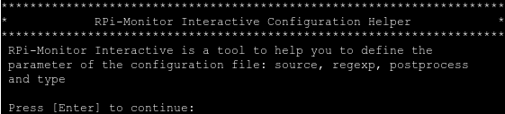

Press ``Enter``

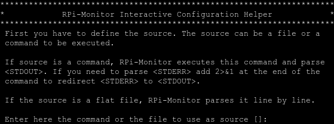

Enter : ``df -t ntfs``

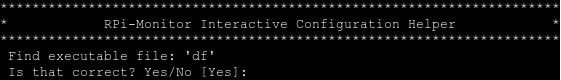

**RPi-Monitor** will tell you how it will process the source.
In our example, it will execute the command ``df``.
If it is correct, press ``Enter``, if not, enter ``no`` ( or ``No`` or ``n`` or ``N`` ) 
to go back to previous screen.

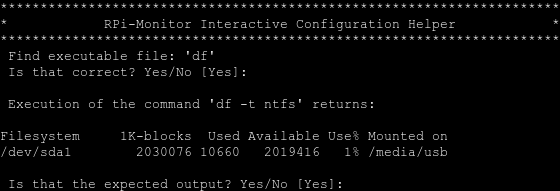

RPi-Monitor show you the ouput of the command as defined as source. If the 
output is the one expected press ``Enter``, if not, **RPi-Monitor** will ask you 
to define the source again.

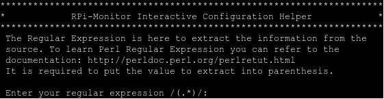

By default the regulare expression is ``(.*)``. This will return all the 
data given by the source.
In the following screen you will see how we will find the regular expression 
extracting the available space of our ntfs drive step by step.

Step one, hit ``Enter`` to see what is given by the source by default.

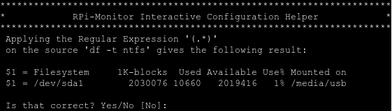

The output is not the one expected hit ``Enter`` to define a new Regular expression.
The data is located after ``sda1``. Lets enter the following regular 
expression: ``sda1(.*)`` to get what is after ``sda1``.

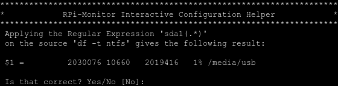

The output is not the one expected yet hit ``Enter`` to define a new regular expression.
The data is located after ``sda1`` after some spaces ``\s+``, some numbers ``\d+``, 
some spaces ``\s+``, some numbers ``\d+``, some spaces`` \s+`` and is composed of numbers ``(\d+)``.
Enter then the following regulare expression: ``sda1\s+\d+\s+\d+\s+(\d+)``

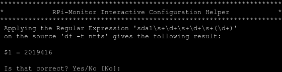

The result is now the one expected , enter ``Yes`` ( or ``yes`` or ``Y`` or ``y`` )

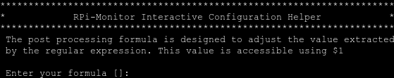

We want the value in ``MB`` while is it given in ``kB``. We then need to devide it by ``1024``.
The formula is then: ``$1/1024``

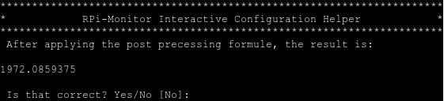

This is the expected value, enter ``yes``

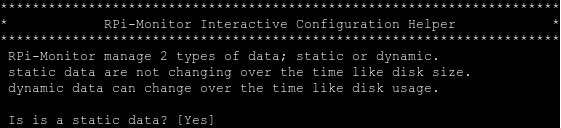

The value extracted is variable so ``dynamic`` so enter ``No``.

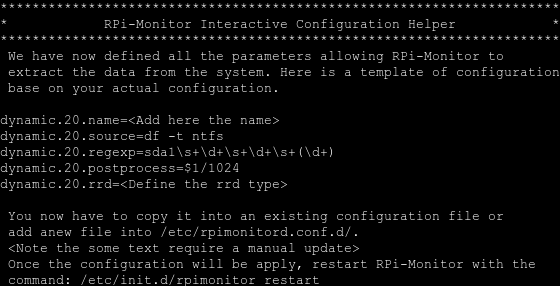

**RPi-Monitor** gives you the template of configuration. You now have to copy it 
into an existing configuration file or add a new file in
``/etc/rpimonitord.conf.d/`` and update the text inside ``<>``.

::

  dynamic.20.name=storage2_available
  dynamic.20.source=df -t ntfs
  dynamic.20.regexp=sda1\s+\d+\s+\d+\s+(\d+)
  dynamic.20.postprocess=$1/1024
  dynamic.20.rrd=GAUGE

Once the configuration will be apply, restart **RPi-Monitor** with the command:

``/etc/init.d/rpimonitor restart``

I hope this post is detailled enough to help you to configure **RPi-Monitor** to 
define the correct sources and regular expression.